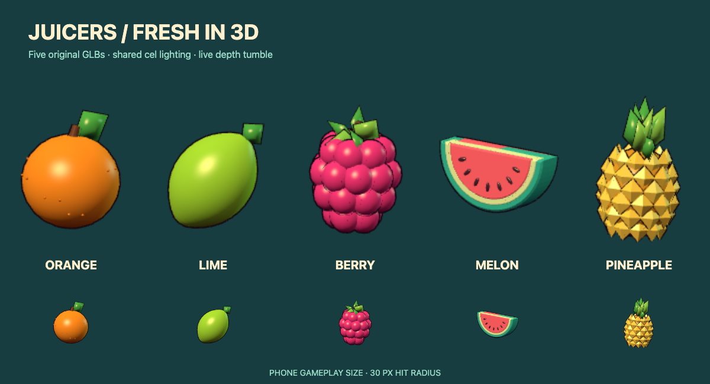
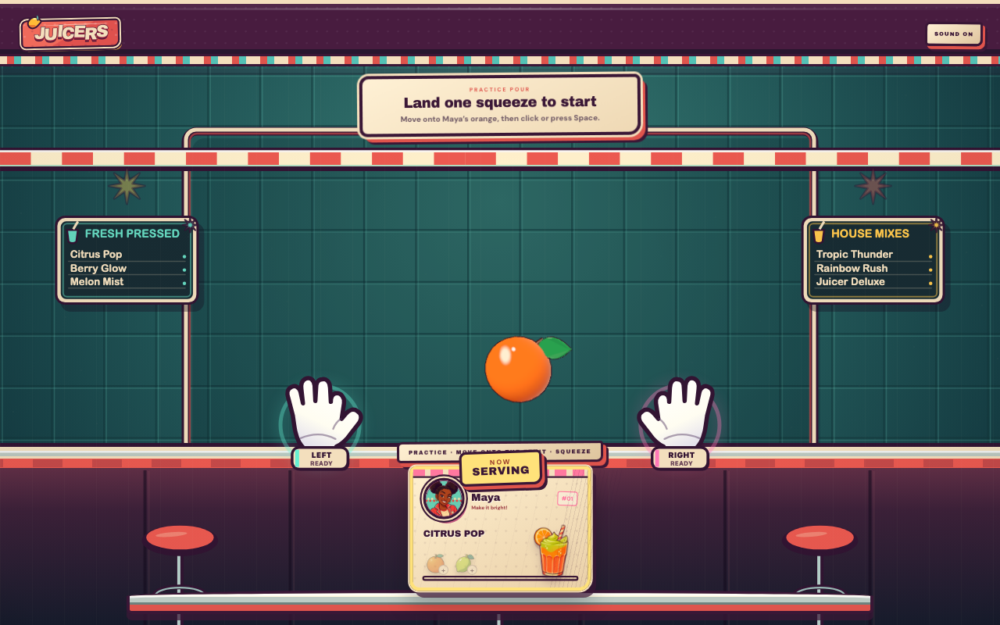
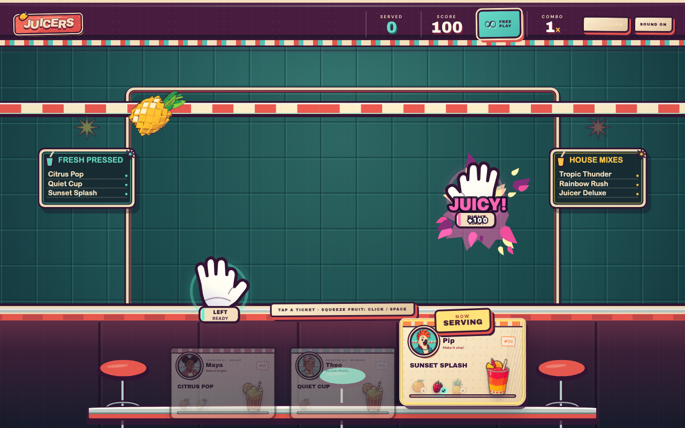
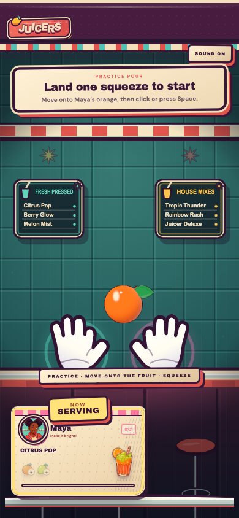

# Fruit meshes — juicy second pass

Opt in with `?fruit3d=1`, then **Play demo mode → Endless Counter**. The practice
orange shows the glaze immediately; squeeze it to see the full falling set.
The flag also works with **Play with camera**. Remove the flag (or use `fruit3d=0`)
and reload for the original illustrated playfield. This PR does not deploy Pages.

## Shared diner treatment

Saturated fruit colors, warm soft shading, an elongated cream reflection plus a
small wet glint, mint edge light, and thinner plum outlines give the set a playful
juice-bar look. Curved leaves, plump raspberry lobes, a freshly cut lime with
individual segments and pulp, a softly beveled melon, and rounded pineapple scales
replace the harder grocery-produce shapes. Gentle yaw and 3.5% squash add bounce;
reduced motion freezes both. Leaves, pith, seeds and stems have quieter gloss.

The glaze uses one texture-free shader shared across the set. There are no texture
maps, downloaded assets, environment maps, shadows, postprocessing, or extra draw
calls for highlights. GLBs retain standard materials for other viewers.

| Ingredient | GLB bytes | Triangles |
| --- | ---: | ---: |
| Orange | 20,284 | 652 |
| Lime | 114,036 | 2,988 |
| Berry | 133,640 | 5,716 |
| Melon | 93,432 | 2,744 |
| Pineapple | 251,944 | 3,728 |
| **Total** | **613,336 (599 KiB)** | **15,828** |

These are original procedural assets, including all second-pass changes and the
shader. [Provenance and MIT terms](../public/fruits/3d/LICENSE.md),
[Three.js license](../public/fruits/3d/THREE-LICENSE.txt), and the
[reproducible generator](../scripts/generate-fruits.mjs) are included.
The asset test enforces a combined 1 MB budget and fewer than 10,000 triangles per
fruit. Every GLB passes Khronos glTF Validator with zero errors and warnings.

## Ticket selection and grabs

The old path was `previewAim → selectAimingHand`: a closed fist took precedence
over the other hand and rewrote `aimedOrderId` each frame. Pour routing separately
used the squeezing hand's X. Cards themselves had no select handler and allowed
pointer events to pass through to the squeeze canvas.

Cards now have native, labeled selection buttons. A stationary primary tap/click
(up to 350 ms and 10 px travel) or native keyboard/assistive activation requests a
ticket ID. Long holds, drags, canceled touches and secondary buttons do not select.
The playfield owns squeeze input; camera frames supply only fruit hit positions
and rising fist edges. Neither hand coordinates nor closed state enter ticket
selection or choose a different pour recipient.

The first open ticket is selected at round start. That ticket stays selected until
an explicit selection or its order completes/leaves; order lifecycle then advances
to the first open ticket. A fruit the selected customer does not need still incurs
the existing wrong-ticket result. Both fists can pour into the selected ticket.
Phone tickets scroll horizontally so every customer remains reachable.

To reproduce the old coupling on main: enter demo, move the right glove toward the
rightmost ticket, then press **Z** while the left glove is in the left column. The
highlight switches when the fist closes. In camera mode, close the hand away from
the currently highlighted column.

To verify the fix on this branch:

1. Tap the middle ticket and watch **NOW SERVING**. Move the mouse across the field,
   hold/release the mouse, use **Z**, **M**, or **Space**, or close either/both camera
   fists in other columns. The ticket stays selected.
2. Hold a different card for over 350 ms, drag across it, or start a playfield grab
   and release over it. None selects that card. A short tap/click selects it.
3. Tab to a card and use Enter/Space. It selects without squeezing a glove.
   Move the mouse back into the playfield to resume keyboard glove control.
4. Select a customer who needs the fruit, overlap it anywhere in the playfield,
   and squeeze either hand. Only the selected ticket fills. Complete recipes,
   finish the session and replay; the queue, scoring and practice still work.
5. On a phone, tap cards and swipe the rail to reach the remaining customers.

## Integration, checks and performance

The renderer still shares the existing game loop and 2D canvas item order. One
fixed **640×640 atlas at DPR 1** renders up to 16 mesh instances. The smaller atlas
offsets the richer geometry and glaze. Geometry/materials are shared and disposed
on unmount; removed items retain no instances. Powerups, collisions, hit radii,
MediaPipe tracking and inference rate are unchanged.

Illustrations cover loading, individually missing meshes, unavailable WebGL,
context loss, and excess atlas capacity. The renderer and GLBs are lazy-loaded only
with the flag; the default path does not fetch them.

- `npm run check`: lint, 26 scoring/audio/asset tests, TypeScript, production build.
- `npm run test:browser`: 14 checks covering demo practice → selected pour → replay;
  default/no GPU requests; partial assets; no WebGL; context loss; phone practice
  and touch selection; canceled touches; holds/drags; keyboard selection; both
  demo fists; both tracked fists; tracked grab/movement/loss with multiple tickets;
  real local MediaPipe startup with a synthetic camera; camera denial recovery;
  shader compilation and reduced-motion stability.
- Production smoke at `/juicers-web/`: all five GLBs return HTTP 200, practice
  completes, ticket selection survives a grab, and no browser/GPU errors occur.
- Production adds a lazy renderer chunk of about **614 kB / 155 kB gzip**. Vite's
  existing >500 kB chunk advisory remains; it does not fail the build.

`node scripts/measure-fruits.mjs` samples 150 frames, discarding the first 31.
macOS, headless Chromium, 30 px fruit hit radius:

| Scenario | Frame median / p95 | Render + composite median / p95 |
| --- | --- | --- |
| Five fruits, normal CPU | 16.7 / 16.8 ms | 10.0 / 10.7 ms |
| Five fruits, 4× CPU slowdown | 16.7 / 16.8 ms | 12.2 / 13.0 ms |
| 16-fruit stress, 4× CPU slowdown | 33.3 / 33.4 ms | 26.7 / 27.8 ms |

Five fruits use 35 draw calls / 27,456 triangles with outlines. The stress case uses
111 calls / 83,672 triangles, with 20 resident geometries and zero instances after
clearing. This is a synthetic renderer check, not a physical-phone or full-camera
benchmark; the full diner canvas and camera inference add work. Real hands and
phone GPU smoothness still need device review, so the fruit path stays opt-in.

## Playfield stills

